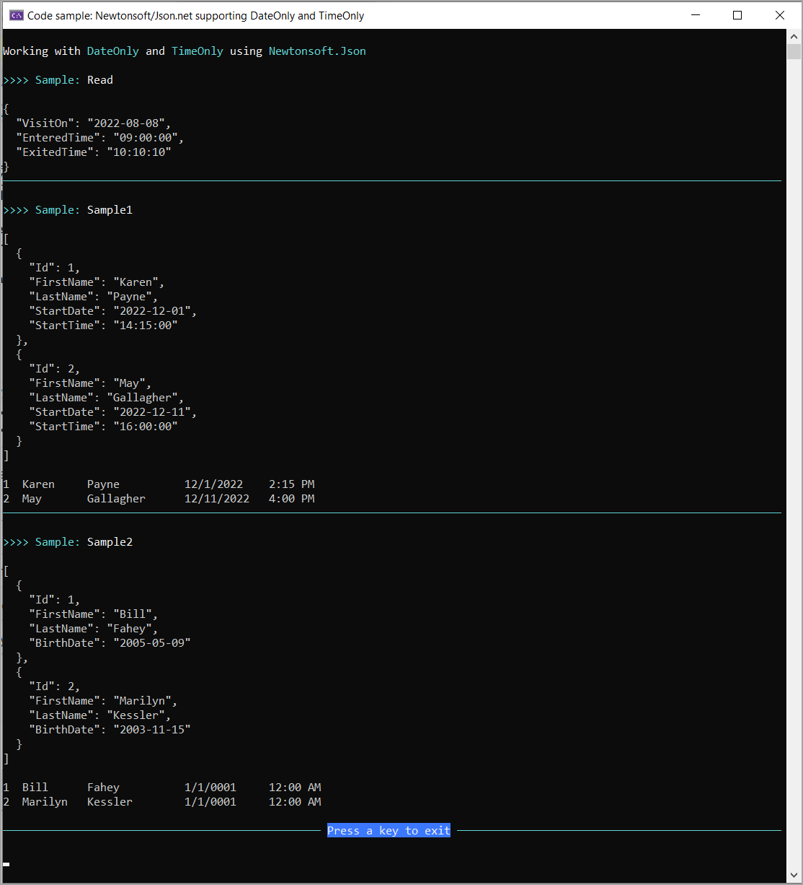

# JSON.NET and DateOnly/TimeOnly support

Code samples for Json.net which as of version 13.0.2 now supports [DateOnly](https://learn.microsoft.com/en-us/dotnet/api/system.dateonly?view=net-7.0) and [TimeOnly](https://learn.microsoft.com/en-us/dotnet/api/system.timeonly?view=net-7.0). Three code samples are used to show interactions with [Bogus](https://github.com/bchavez/Bogus) and [Microsoft.Data.SqlClient](https://github.com/dotnet/SqlClient/blob/main/release-notes/5.1/5.1.0-preview2.md) which is most likely used to work with json data.

| Sample        |   Description    |
|:------------- |:-------------|
| Sample1 | Created a list of mocked people, serialize then deserialize with Json.net | 
| Sample2 | Same as Sample1 but uses Bogus NuGet package to create a list. Bogus just began support for DateOnly and TimeOnly with Json.net | 
| DataOperations.Read | Reads DateOnly and TimeOnly from a SQL-Server database using a preview2 version of Microsoft.Data.SqlClient to seriale to json with Json.net | 

# Important

:stop_sign: Please run the script under the folder DataScripts before running this code.

# Requires

- Microsoft [Visual Studio](https://visualstudio.microsoft.com/downloads/) 2022 v17.4 or higher
- For the data read sample, [SQLEXPRESS](https://www.microsoft.com/en-us/sql-server/sql-server-downloads).

---

**json**

```json
[
  {
    "Id": 1,
    "FirstName": "Karen",
    "LastName": "Payne",
    "StartDate": "2022-12-01",
    "StartTime": "14:15:00"
  },
  {
    "Id": 2,
    "FirstName": "May",
    "LastName": "Gallagher",
    "StartDate": "2022-12-11",
    "StartTime": "16:00:00"
  }
]
```

**Model**

```csharp
public class Container
{
    public int Id { get; set; }
    public string FirstName { get; set; }
    public string LastName { get; set; }
    public DateOnly StartDate { get; set; }
    public TimeOnly StartTime { get; set; }
}
```

**Mocked data**

```csharp
public class Mocked
{
    public  static List<Container> Container() =>
        new()
        {
            new()
            {
                Id = 1, 
                FirstName = "Karen", 
                LastName = "Payne", 
                StartDate = new DateOnly(2022,12,1), 
                StartTime = new TimeOnly(14,15)
            },
            new()
            {
                Id = 2, 
                FirstName = "May", 
                LastName = "Gallagher", 
                StartDate = new DateOnly(2022,12,11), 
                StartTime = new TimeOnly(16,0)
            }
        };
}
```

Get mocked data

```csharp
var containers = Mocked.Container();
```

Serialize data

```csharp
string json = JsonConvert.SerializeObject(containers, Formatting.Indented);
```

Deserialize data

```csharp
var readContainers = JsonConvert.DeserializeObject<List<Container>>(json);
```




