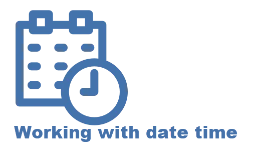

Various code samples for teaching using Visual Studio 2019, .NET Core, C#9.

There are basic, intermediate and advance level code samples. Suggest examining the code, run the application then go back and study the code for learning purposes.

:green_circle: Make sure to review [Microsoft docs](https://docs.microsoft.com/en-us/dotnet/api/system.datetime.add?view=net-5.0) for common DateTime methods and [DateTimeOffset](https://docs.microsoft.com/en-us/dotnet/api/system.datetimeoffset?view=net-5.0)

:green_circle: [Custom date and time format strings](https://docs.microsoft.com/en-us/dotnet/standard/base-types/custom-date-and-time-format-strings)

 

